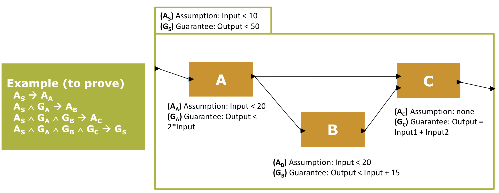

## Quick Start

### **Start CoCoSim**
For every new Matlab session:
+ Launch Matlab(c)
+ Navigate to `CoCoSim/`
+ Run in Matlab command window ```start_cocosim```

You can add the previous steps in your ```startup.m``` script in ```MATLAB``` directory. If the script does not exist you can create a new one. 
At startup, MATLAB automatically executes, if it exists on the MATLAB search path, startup function. Read more about it hear [User-defined startup script for MATLAB](https://www.mathworks.com/help/matlab/ref/startup.html)

### **Check Compatibility example**:

<!-- 1. To test an example for compatibility: `open examples/contract/bacteriaPopulationStateflow.slx` -->
1. Open your Simulink model
2. Set your default Simulink to Lustre compiler to NASA compiler in `Tools -> CoCoSim -> Preferences -> Simulink To Lustre compiler -> NASA compiler `. The second compiler does not support a compatibility check.
3. Under the `Tools -> CoCoSim` menu choose `Check Compatibility`.

The checking compatibility does not guarantee that the model is fully supported but it detects the blocks/options we already know we do not support.
You may have other error messages that a specific block is not supported.
In addition the compatibility is performed for Verification, a model can be supported for verification and not for code generation.

<!-- You will get an HTML report with Unsupported blocks. In this example, the chart block is not supported for the reason "Event "dummyEvent" in chart bacteriaPopulationStateflow_PP/bacteriaPopulation/bacteriaPopulation with "Function call" Trigger is not supported.".

To fix it, click right on the chart block, then click on `explore` and remove the event "dummyEvent" (by clicking right and do Cut or click on delete on tools bar). -->


<!-- ### Check Model against guidelines:

1. To test an example for guidelines: `open examples/guidelines/guideLines1.slx`
2. Under the `Tools -> CoCoSim` menu choose `Check model against guidelines`.

An Html report should be generated containing guidelines devided in three categories: Mandatory, Strongly Recommended, Recommended. Click on each one of them to get more details. -->

### **Requirements formal verification example**:
0. Add your properties to the Simulink model to be proved by CoCoSim. See [CoCoSim Specification Library](https://github.com/coco-team/cocoSim2/blob/master/doc/specificationLibrary.md). 

1. To test an example with properties: `open examples/demo/ABC.slx`. The example is described in the following figure.


2. Set your default model checker in `Tools -> CoCoSim -> Preferences -> Verification Backend`. Currently, only [Kind2](https://github.com/kind2-mc/kind2) is supported.
3. Enable or Disable Compositional setting for Kind2 in `Tools -> CoCoSim -> Preferences -> Kind2 Preferences -> Compositional Analysis`. Read more about Compositional Analysis in the 
[CoCoSim manual](cocosim_user_manual.pdf).
4. You can set other preferences such as `Verification Timeout`, `CoCoSim Verbosity`, `Compiler Preferences` ... in `Tools -> CoCoSim -> Preferences`.
5. Under the `Tools -> CoCoSim` menu choose `Prove properties`.


### **Design Error Detection**:
Under the `Tools -> CoCoSim` menu choose `Design Error Detection`.\
This feature is in progress work. The list of checks are found in 
`Tools -> CoCoSim -> Preferences -> Design Error Detection Checks`.
It Currently supports checking OutMin and OutMax of Simulink block outputs specified by the user through OutMin, OutMax parameters. See [Simulink Signal Ranges](https://www.mathworks.com/help/simulink/ug/signal-ranges.html).


### **Code Generation**:

CoCoSim supports code generation to C, Rust, Lustre and Prelude.\
Under the `Tools -> CoCoSim` menu choose `Generate Code`.

### **Compatibility with Simulink Design Verifier**:
CoCoSim has its own [Specification Library](https://github.com/coco-team/cocoSim2/blob/master/doc/specificationLibrary.md).
In addition, CoCoSim support the verification library of Simulink Design Verifier (SLDV). No need to transform those block to CoCoSim specification blocks.

If you want to run SLDV on a model containing CoCoSim contracts, we offer an automated transformation to SLDV blocks from CoCoSim contracts. Under the `Tools -> CoCoSim` menu choose `Extra options -> Transform Contract to SLDV`.
A new model will be created containing SLDV verification blocks (Assertion, Proof..) instead of CoCoSim contracts.

Note: The use of Contracts in CoCoSim is different from the use of SLDV verification blocks. In CoCoSim, contracts are attached to Subsystems and specify local properties about that specific Subsystem, therefore to prove that contract against the Subsystem, the verification does not care about the Subsystem connections in its parent scope. The user is required to explicitly specify enough Assumptions on the inputs of the Subsystem.\
For Example, a contract **C** attached to a Subsystem **S**, and **I** is an inport of **S** and is linked to a Constant block outside **S**. If the user did not add an assumption in **C** expressing that the input **I** is constant, the contract **C** can be falsified for a given **I** that is different from the constant used in the model. The contract is unaware of what is outside **S**.

<!-- ### Test-case generation example:

1. To test an example with properties: `open examples/test_generation/mcdc_test.slx`
2. Under the `Tools -> CoCoSim` menu choose `Test-case generation using...`. -->